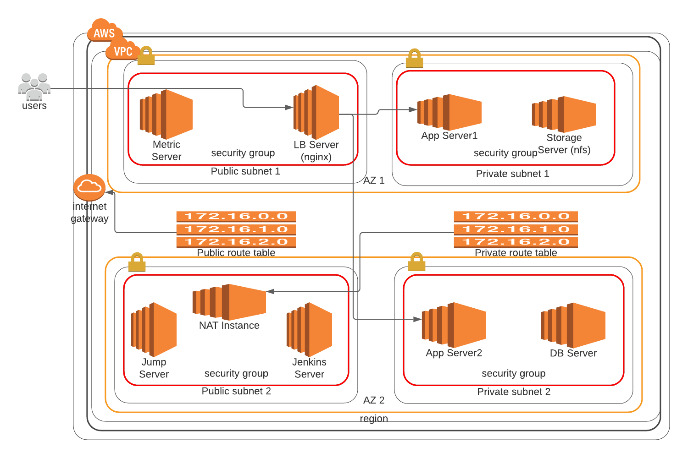

# Welcome to the Task Masker Data Center

**Infrastructure Architectural Design**

Please read through to understand the architecture of this data center.

This Data Center uses Terraform (an IaC) tool to provision infrastructure on AWS on which we are deploying our application and other necessary technologies/ tools to enable effective operation and monitoring of the application while in production.

At the current stage the infrastructure comprises of 9 ec2 servers that perform different operations to ensure that the application is up and running on AWS Cloud. Below you will find the description of the functions of each of the servers and how they work together to server our Task marker application.

As already mentioned, the backbone of this infrastructure is Terraform which we are using to deploy as Infrastructure as Code (IaC). Also, the are several userdata shell scripts specific to the individual servers that is used to configure the servers to enable them perform their respective functions in serving the application.

To enable a **Push Button** and repeatitive Deployment of this infrastructure there is a **deploy.sh** script also present in this directory. You will find more detailed description of the **deploy.sh** script near the button of this page [Click Here](#Deploying-the-Infrastructure).

### Components of the Data Center

This Data Center comprises of Nine ec2 instance servers as listed below

- VPC network
- 2 Public subnets spread across two availability zones
- 2 Private subnets spread across two availability zones
- Public Route Table with association to the public subnets
- Private Route Table with association to the private subnet
- Internet gateway attached to the VPC and public Route Table
- EC2 Nat instance place in one of the public subnets
- Security Groups - there are several Security groups configured to meet the needs of the various servers.

- EC2 Nat Instance server (1) 
- Web server (1), also server as load balancer server
- App Servers (2)
- Database Server (1)
- Storage Server (1)
- Jenkins Server (1)
- Metrics Server (1)
- Jump Server/ Bastion Host (1)

## Description of the Functions of the Servers

### EC2 Nat Instance server
The Nat instance functions as our NAT Server to enable servers in the private subnet reach out to the internet for updates and installation of application packages. The nat instance is placed in the public subnets. In our Private Route table we have a route that direct traffic targetted at the internet to the Nat instance which as been configured to send the traffic to the public internet.

### Web server

The web server runs nginx web server to serve the frontend (React App) of our application. The nginx server also acts as a Load Balancer to direct traffic to the API servers. The configuration code for the Web server is `userdata-lb.sh`. Amongst other thing it,

- Installs nginx and configure it as Load Balancer for the App Servers
- Clone the Application repostory, Install packages, Build the frontend react file, and save the build artifact in the nginx working directory

### App Servers

There are two App Servers spread across two availability zone and protected from access from the public internet as the are in a private subnet. The App server will accept api request from the LB server. The userdata for the App servers is `userdata.sh`. The userdata for the App servers primary 

- Install node.js.
- Create and configure systemd unit for the applications to enable systemd manage the application.
- Mounts nfs share directory `/todo-er` to get the application code from the Storage server.
- Once the `nfs shared` directory `/todo-er` is mounted, configure env variables and start the application.

- **Note** The application will only be started when the server can confirm that the Database server is fully set up and ready to receive traffic.

### Database Server

The Database server host PostgreSQL database engine and server as the persistent storage for the application. The DB server is also in the private subnet hence protected from the public internet. The DB server will able to accept read/write requests from the application servers. The userdata script for the DB server is `userdata-db.sh`. The userdata will

- Install PostgreSQL DB engine.
- Create a unix user that the database will use.
- Configure the database to enable it accept traffic from the App servers.
- Create the database, and database user for the application.
- Grant permission on the database to the database user created.
- Start the postgresql service

**Note:** The app servers will attempt to wait for sometime to ensure the database is reachable before start the backend service.

### Storage Server

The Storage server acts as centralize data store for the application. This is where we can share or save files like backups, log data or other files that we might be needed by other servers. Majorly, it would be necessary to mount `nfs` shared directory where data can be stored and retrived. For example, we are using storage server to share our application code to the App servers. The userdata for the Storage server is `userdata-storage.sh`. The userdata will

- Clone the application code from the github repository
- Clone the `data-modela` module from the repository
- Install the dependencies and run tests
- Use npm link to link `data-modela` module to node_modules in the application.
- Mount `/modela`, `/todo-er` as NFS shared directory to App servers

**Note:** The app servers will attempt to wait for sometime for shared directories `/modela`, and  `/todo-er` to be mounted to get access to the source code. Unless the directory is mounted, the application cannot be served, at this time.

### Jenkins Server

We will be using Jenkins as the CD server for our application. After the initial deployment of the application, We want to ensure that Jenkins is fully setup to act as our Continuous Delivery/Continuous Deployment server. Jenkins will be used for running build jobs, testing and Delivery or Deploying to various environments like dev, testing, staging and production. The userdata for the Jenkins Server is `userdata-jenkins.sh`. The userdata script will

- Install Java package
- Install Jenkins
- Install postgresql package
- Start the Jenkins server

Once the initial deployment is complete Jenkins will be fully ready and we access the Jenkins UI and configure it and create pipelines that will be used for updating the application while in production or in other environments

### Metrics Server

To effectively operate our production application, we need a way to monitor, observe and gather metrics and ensure observeability of our application. This will ensure we know the health status of our application and we will be able to respond to failures in the application before they have negative impact on our customers. The metrics server will serve this purpose. The metrics server will install and configure various monitoring and logging tools, like Nagios, Zabbix, Prometheus, Grafana etc. With these tools we will be able to track changes our application and ensure that we can quickly respond to the health status of our application. The userdata for the metric server is `userdata-metrics.sh`. The userdata will 

- Install and Configure Nagios to monitor all the other servers
- Install and configure Zabbix and ensure that Zabbix is fully setup after the deployment completes
- Install and configure Grafana
- Install and configure Prometheus

After deployment completes, we are able to access the dashboard of each of the tools and ensure that our application is been monitored.

### Jump Server/ Bastion Host

The Jump server will act as our access points to each of the other servers been managed. In our infrastructure we will be using Puppet and Ansible as the major Configuration Management tools (CaC). DevOps engineers and System Administrators will be able to login/access the server to configure the other servers when it becomes necessary. As we are installing and configuring Puppet and Ansible on the server to as Master, with the other servers as slave nodes. The userdata for the Jump server is `userdata-jump.sh`. This userdata like the jump server does quite a lot in terms of configuration.

- Install and configure puppet, also enable puppet autosign certificate
- The the puppet configuration
- Install Ansible, Create dedicated ansible user and grant sudo access.
- Use puppet to copy Ansible user ssh authorization key to the various slave nodes
- Test as configuration (using ansible gather_facts)
- Use Ansible to Create dedicated users in the various managed servers
- Use Puppet to copy ssh authorized keys for the various users to the slave nodes
- Use Ansible to generate ssh key on Jenkins server and copy the ssh public key to the dedicated users on the other servers. 

**Note** At this time, there are only two servers with public ssh access. The jump server and metrics server. To login to the other servers, one must first ssh into either the jump server or the metric server (these two servers has public ssh access. The others has only internal ssh access).

### General configurations

There are some some installation and configuration that needs to be done on all servers. To ensure that we have a single source of truth on the installation and configuration, The configurations are done in the `./deploy.sh` script and there are placeholders the various userdata scripts. When `./deploy.sh` is executed the scripts will be copied to the userdata files where the match for the placeholder is found. After Terraform has finish executing, the changes are reversed.

Some general installation and configuration

- Install and enable epel repository
- Adding swap file
- Installation and configuration of puppet agent nodes
- Creation of dedicated ansible users and setting sudo privileges
- Installation and Configution of Nagios NRPE agent
- Installation and Configuration Node Exporter
- Installation and Configuration Zabbix agents

## Deploying the Infrastructure

The infrastructure can be deployed in a repeatable way using the `./deploy.sh` script. The script is a helper for managing variables and shared scripts across the different servers. It also help to echo that secret credentials are not exposed in the source code. The script will prove to be a single source of truth for installation, and variables that are shared across all userdata scripts.

Before executing the `./deploy.sh` script please copy over the content of the `envfile-example` to `envfile` and files with the appropriate values. The `envfile` contains secrets and variables that is needed to successfully deploy the infrastructure in a repeatable. This file is require by the `./deploy.sh` script to get and populate terraform variables and other variables needed by the userdata scripts.

To ensure that the source code always stay unchange from repeatable deploy, any changes made during the deploy process is automatically reversed after Terraform finish provision on in the event that the Terraform command fail. The only place where you need to make any modification is the `envfile` and is not to be committed to source code repository.

To deploy, execute the following commands

Change directory to the Terraform working directory

Run `cd ./tf-aws`

Copy the envfile-example to envfile

Run `cp envfile-example envfile` 

Then, open the file and fill in the appropriate variables

Run `./deploy.sh` 

This will about provisioning our infrastructure on AWS. Once the infrastructure has finish provisioning, you should be able to login to the server using the ip address and dns output of Terraform.

**NOTE:** After the Terraform finish provisioning, it will take some time before the server will be fully ready. This is because of the time needed to execute userdata scripts. Also some of the server will need to wait for others to have provisioned a particular software before they can proceed with their configuration. For example App server 1 and App Server 2 will need to wait for Storage server to download, install and mount the source code on `/todo-er` directory before attempting to start the backend service.
